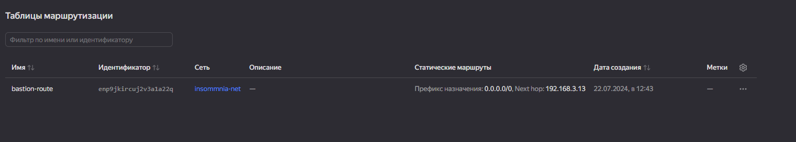

#  Курсовая работа на профессии "DevOps-инженер с нуля" - С. Яремко

Содержание
==========
* [Задача](#Задача)
* [Инфраструктура](#Инфраструктура)
    * [Сайт](#Сайт)
    * [Мониторинг](#Мониторинг)
    * [Логи](#Логи)
    * [Сеть](#Сеть)
    * [Резервное копирование](#Резервное-копирование)
    * [Дополнительно](#Дополнительно)
* [Выполнение работы](#Выполнение-работы)
* [Критерии сдачи](#Критерии-сдачи)
* [Как правильно задавать вопросы дипломному руководителю](#Как-правильно-задавать-вопросы-дипломному-руководителю) 

---------
## Задача
Ключевая задача — разработать отказоустойчивую инфраструктуру для сайта, включающую мониторинг, сбор логов и резервное копирование основных данных. Инфраструктура должна размещаться в [Yandex Cloud](https://cloud.yandex.com/).

## Инфраструктура
Для развёртки инфраструктуры используйте Terraform и Ansible. 

Параметры виртуальной машины (ВМ) подбирайте по потребностям сервисов, которые будут на ней работать. 

Ознакомьтесь со всеми пунктами из этой секции, не беритесь сразу выполнять задание, не дочитав до конца. Пункты взаимосвязаны и могут влиять друг на друга.

### Сайт
Создайте две ВМ в разных зонах, установите на них сервер nginx, если его там нет. ОС и содержимое ВМ должно быть идентичным, это будут наши веб-сервера.

Используйте набор статичных файлов для сайта. Можно переиспользовать сайт из домашнего задания.

Создайте [Target Group](https://cloud.yandex.com/docs/application-load-balancer/concepts/target-group), включите в неё две созданных ВМ.

Создайте [Backend Group](https://cloud.yandex.com/docs/application-load-balancer/concepts/backend-group), настройте backends на target group, ранее созданную. Настройте healthcheck на корень (/) и порт 80, протокол HTTP.

Создайте [HTTP router](https://cloud.yandex.com/docs/application-load-balancer/concepts/http-router). Путь укажите — /, backend group — созданную ранее.

Создайте [Application load balancer](https://cloud.yandex.com/en/docs/application-load-balancer/) для распределения трафика на веб-сервера, созданные ранее. Укажите HTTP router, созданный ранее, задайте listener тип auto, порт 80.

Протестируйте сайт
`curl -v <публичный IP балансера>:80` 

### Мониторинг
Создайте ВМ, разверните на ней Zabbix. На каждую ВМ установите Zabbix Agent, настройте агенты на отправление метрик в Zabbix. 

Настройте дешборды с отображением метрик, минимальный набор — по принципу USE (Utilization, Saturation, Errors) для CPU, RAM, диски, сеть, http запросов к веб-серверам. Добавьте необходимые tresholds на соответствующие графики.

### Логи
Cоздайте ВМ, разверните на ней Elasticsearch. Установите filebeat в ВМ к веб-серверам, настройте на отправку access.log, error.log nginx в Elasticsearch.

Создайте ВМ, разверните на ней Kibana, сконфигурируйте соединение с Elasticsearch.

### Сеть
Разверните один VPC. Сервера web, Elasticsearch поместите в приватные подсети. Сервера Zabbix, Kibana, application load balancer определите в публичную подсеть.

Настройте [Security Groups](https://cloud.yandex.com/docs/vpc/concepts/security-groups) соответствующих сервисов на входящий трафик только к нужным портам.

Настройте ВМ с публичным адресом, в которой будет открыт только один порт — ssh. Настройте все security groups на разрешение входящего ssh из этой security group. Эта вм будет реализовывать концепцию bastion host. Потом можно будет подключаться по ssh ко всем хостам через этот хост.

### Резервное копирование
Создайте snapshot дисков всех ВМ. Ограничьте время жизни snaphot в неделю. Сами snaphot настройте на ежедневное копирование.

### Дополнительно
Не входит в минимальные требования. 

1. Для Zabbix можно реализовать разделение компонент - frontend, server, database. Frontend отдельной ВМ поместите в публичную подсеть, назначте публичный IP. Server поместите в приватную подсеть, настройте security group на разрешение трафика между frontend и server. Для Database используйте [Yandex Managed Service for PostgreSQL](https://cloud.yandex.com/en-ru/services/managed-postgresql). Разверните кластер из двух нод с автоматическим failover.
2. Вместо конкретных ВМ, которые входят в target group, можно создать [Instance Group](https://cloud.yandex.com/en/docs/compute/concepts/instance-groups/), для которой настройте следующие правила автоматического горизонтального масштабирования: минимальное количество ВМ на зону — 1, максимальный размер группы — 3.
3. В Elasticsearch добавьте мониторинг логов самого себя, Kibana, Zabbix, через filebeat. Можно использовать logstash тоже.
4. Воспользуйтесь Yandex Certificate Manager, выпустите сертификат для сайта, если есть доменное имя. Перенастройте работу балансера на HTTPS, при этом нацелен он будет на HTTP веб-серверов.

## Выполнение работы
На этом этапе вы непосредственно выполняете работу. При этом вы можете консультироваться с руководителем по поводу вопросов, требующих уточнения.

⚠️ В случае недоступности ресурсов Elastic для скачивания рекомендуется разворачивать сервисы с помощью docker контейнеров, основанных на официальных образах.

**Важно**: Ещё можно задавать вопросы по поводу того, как реализовать ту или иную функциональность. И руководитель определяет, правильно вы её реализовали или нет. Любые вопросы, которые не освещены в этом документе, стоит уточнять у руководителя. Если его требования и указания расходятся с указанными в этом документе, то приоритетны требования и указания руководителя.

## Критерии сдачи
1. Инфраструктура отвечает минимальным требованиям, описанным в [Задаче](#Задача).
2. Предоставлен доступ ко всем ресурсам, у которых предполагается веб-страница (сайт, Kibana, Zabbix).
3. Для ресурсов, к которым предоставить доступ проблематично, предоставлены скриншоты, команды, stdout, stderr, подтверждающие работу ресурса.
4. Работа оформлена в отдельном репозитории в GitHub или в [Google Docs](https://docs.google.com/), разрешён доступ по ссылке. 
5. Код размещён в репозитории в GitHub.
6. Работа оформлена так, чтобы были понятны ваши решения и компромиссы. 
7. Если использованы дополнительные репозитории, доступ к ним открыт. 

## Как правильно задавать вопросы дипломному руководителю
Что поможет решить большинство частых проблем:
1. Попробовать найти ответ сначала самостоятельно в интернете или в материалах курса и только после этого спрашивать у дипломного руководителя. Навык поиска ответов пригодится вам в профессиональной деятельности.
2. Если вопросов больше одного, присылайте их в виде нумерованного списка. Так дипломному руководителю будет проще отвечать на каждый из них.
3. При необходимости прикрепите к вопросу скриншоты и стрелочкой покажите, где не получается. Программу для этого можно скачать [здесь](https://app.prntscr.com/ru/).

Что может стать источником проблем:
1. Вопросы вида «Ничего не работает. Не запускается. Всё сломалось». Дипломный руководитель не сможет ответить на такой вопрос без дополнительных уточнений. Цените своё время и время других.
2. Откладывание выполнения дипломной работы на последний момент.


### Решение.

Сначала было ничего:


Но после создания и запуска файла main.tf для terraform:

Файл main.tf:

```HCL
# -----Create infrostructure-----

#image_id = "fd85bll745cg76f707mq" webserver
#image_id = "fd8rp5pmb90k8l5o8php" bastion

terraform {
  required_providers {
    yandex = {
      source = "yandex-cloud/yandex"
    }
  }
}

provider "yandex" {
  token     = var.token
  cloud_id  = var.cloud_id
  folder_id = var.folder_id
}

#webservers
resource "yandex_compute_instance" "webserver" {
  count       = 2
  name        = "webserver${count.index + 1}"
  hostname    = "webserver${count.index + 1}"
  platform_id = "standard-v3"
  zone        = "ru-central1-${count.index == 0? "a" : "b"}"

  resources {
    cores         = 2
    memory        = 2
    core_fraction = 20
  }
  
  scheduling_policy {
    preemptible = true
  }

  boot_disk {
    initialize_params {
      image_id = "fd8s4a9mnca2bmgol2r8"
      size     = 10
      type     = "network-hdd"
    }
  }

  network_interface {
    subnet_id          = count.index == 0? yandex_vpc_subnet.web-sub-a.id : yandex_vpc_subnet.web-sub-b.id  
    security_group_ids = [ yandex_vpc_security_group.webserver-sg.id, yandex_vpc_security_group.internet-sg.id ]    
  }

  metadata = {
    user-data = "${file("/home/s_yaremko/devops/meta.yml")}"
  }
}

#bastion
resource "yandex_compute_instance" "bastion" {
  name        = "bastion"
  hostname    = "bastion"
  platform_id = "standard-v3"
  zone        = "ru-central1-a"

  resources {
    cores         = 2
    memory        = 2
    core_fraction = 20
  }
  
  scheduling_policy {
    preemptible = true
  }

  boot_disk {
    initialize_params {
      image_id = "fd806u1okplml22f4pmo"
      size     = 10
      type     = "network-hdd"
    }
  }

  network_interface {    
    subnet_id          =  yandex_vpc_subnet.external-sub-c.id     
    security_group_ids = [ yandex_vpc_security_group.bastion-sg.id, yandex_vpc_security_group.internet-sg.id ]  
    nat                = true  
  }
  
  metadata = {
    user-data = "${file("/home/s_yaremko/devops/meta_bastion.yml")}"
  }
}

output "bastion_nat_ip_address" {
  value = yandex_compute_instance.bastion.network_interface.0.nat_ip_address
}

#elasticsearch
resource "yandex_compute_instance" "elastic" {
  name        = "elastic"
  hostname    = "elastic"
  platform_id = "standard-v3"
  zone        = "ru-central1-a"

  resources {
    cores         = 4
    memory        = 4
    core_fraction = 20
  }
  
  scheduling_policy {
    preemptible = true
  }

  boot_disk {
    initialize_params {
      image_id = "fd8s4a9mnca2bmgol2r8"
      size     = 15
      type     = "network-hdd"
    }
  }

  network_interface {    
    subnet_id          =  yandex_vpc_subnet.external-sub-c.id     
    security_group_ids = [ yandex_vpc_security_group.elastic-sg.id, yandex_vpc_security_group.internet-sg.id ]      
  }
  
  metadata = {
    user-data = "${file("/home/s_yaremko/devops/meta.yml")}"
  }
}

#kibana
resource "yandex_compute_instance" "kibana" {
  name        = "kibana"
  hostname    = "kibana"
  platform_id = "standard-v3"
  zone        = "ru-central1-a"

  resources {
    cores         = 2
    memory        = 4
    core_fraction = 20
  }
  
  scheduling_policy {
    preemptible = true
  }

  boot_disk {
    initialize_params {
      image_id = "fd8s4a9mnca2bmgol2r8"
      size     = 15
      type     = "network-hdd"
    }
  }

  network_interface {    
    subnet_id          = yandex_vpc_subnet.external-sub-c.id    
    security_group_ids = [ yandex_vpc_security_group.kibana-sg.id, yandex_vpc_security_group.internet-sg.id ]  
    nat = true    
  }
  
  metadata = {
    user-data = "${file("/home/s_yaremko/devops/meta.yml")}"
  }
}

output "kibana_nat_ip_address" {
  value = yandex_compute_instance.kibana.network_interface.0.nat_ip_address
}

#zabbix_server
resource "yandex_compute_instance" "zabbix" {
  name        = "zabbix"
  hostname    = "zabbix"
  platform_id = "standard-v3"
  zone        = "ru-central1-a"

  resources {
    cores         = 2
    memory        = 2
    core_fraction = 20
  }
  
  scheduling_policy {
    preemptible = true
  }

  boot_disk {
    initialize_params {
      image_id = "fd8s4a9mnca2bmgol2r8"
      size     = 20
      type     = "network-hdd"
    }
  }

  network_interface {    
    subnet_id          = yandex_vpc_subnet.external-sub-c.id    
    security_group_ids = [ yandex_vpc_security_group.zabbix-sg.id, yandex_vpc_security_group.internet-sg.id ]  
    nat = true    
  }
  
  metadata = {
    user-data = "${file("/home/s_yaremko/devops/meta.yml")}"
  }
}

output "zabbix_nat_ip_address" {
  value = yandex_compute_instance.zabbix.network_interface.0.nat_ip_address
}

#network
resource "yandex_vpc_network" "insommnia-net" {
  name = "insommnia-net"
}

#subnets
resource "yandex_vpc_subnet" "web-sub-a" {
  name = "web-sub-a"
  v4_cidr_blocks = ["192.168.1.0/24"]
  zone           = "ru-central1-a"
  network_id     = yandex_vpc_network.insommnia-net.id
  route_table_id = yandex_vpc_route_table.bastion-route.id
}

resource "yandex_vpc_subnet" "web-sub-b" {
  name = "web-sub-b"
  v4_cidr_blocks = ["192.168.2.0/24"]
  zone           = "ru-central1-b"
  network_id     = yandex_vpc_network.insommnia-net.id
  route_table_id = yandex_vpc_route_table.bastion-route.id
}

resource "yandex_vpc_subnet" "external-sub-c" {
  name = "external-sub-c"
  v4_cidr_blocks = ["192.168.3.0/24"]
  zone           = "ru-central1-a"
  network_id     = yandex_vpc_network.insommnia-net.id
}

resource "yandex_vpc_route_table" "bastion-route" {
  name        = "bastion-route"

  depends_on = [ yandex_compute_instance.bastion ]

  network_id = yandex_vpc_network.insommnia-net.id

  static_route {
    destination_prefix = "0.0.0.0/0"
    next_hop_address   = yandex_compute_instance.bastion.network_interface.0.ip_address
  }
}

#security_ for internet
resource "yandex_vpc_security_group" "internet-sg" {
  name        = "internet-sg"
  network_id  = yandex_vpc_network.insommnia-net.id

  egress {
    protocol       = "ANY"    
    v4_cidr_blocks = ["0.0.0.0/0"] 
    from_port      = 0
    to_port        = 65535 
  }

  ingress {
    protocol       = "ICMP"    
    v4_cidr_blocks = ["0.0.0.0/0"] 
  }
}

#security_group for bastion
resource "yandex_vpc_security_group" "bastion-sg" {
  name        = "bastion-security-group"
  network_id  = yandex_vpc_network.insommnia-net.id

  ingress {
    protocol          = "ANY"
    from_port         = 0
    to_port           = 65535
    v4_cidr_blocks = ["192.168.1.0/24", "192.168.2.0/24"]  
  }

  ingress {
    protocol       = "TCP"
    v4_cidr_blocks = ["0.0.0.0/0"]        
    port           = 22
   }  
}

#security_group for alb
resource "yandex_vpc_security_group" "alb-sg" {
  name        = "alb_load_balancer-security-group"
  network_id  = yandex_vpc_network.insommnia-net.id

  ingress {
    protocol       = "TCP"   
    v4_cidr_blocks = ["0.0.0.0/0"]    
    port           = 80
   }

   ingress {
    protocol       = "TCP"   
    v4_cidr_blocks = ["0.0.0.0/0"]    
    port           = 443
   }

   ingress {
    protocol       = "TCP"   
    predefined_target = "loadbalancer_healthchecks"        
    port           = 30080     
   }
}

#security_group for webserver
resource "yandex_vpc_security_group" "webserver-sg" {
  name        = "webserver-security-group"
  network_id  = yandex_vpc_network.insommnia-net.id
  
  ingress {
    protocol       = "TCP"    
    security_group_id = yandex_vpc_security_group.alb-sg.id
  }

  ingress {
    protocol          = "TCP"      
    security_group_id = yandex_vpc_security_group.bastion-sg.id   
    port              = 22
   }    

  ingress {
    protocol       = "TCP"    
    security_group_id = yandex_vpc_security_group.zabbix-sg.id   
    from_port         = 10050
    to_port           = 10051
  }
}

#security_group for elasticsearch
resource "yandex_vpc_security_group" "elastic-sg" {
  name        = "elastic-security-group"
  network_id  = yandex_vpc_network.insommnia-net.id
  
  ingress {
    protocol       = "TCP"    
    v4_cidr_blocks = ["0.0.0.0/0"]  
    port           = 9200
  }

  ingress {
    protocol          = "TCP"      
    security_group_id = yandex_vpc_security_group.bastion-sg.id   
    port              = 22
   }    
}

#security_group for kibana
resource "yandex_vpc_security_group" "kibana-sg" {
  name        = "kibana-security-group"
  network_id  = yandex_vpc_network.insommnia-net.id
  
  ingress {
    protocol       = "TCP"    
    v4_cidr_blocks = ["0.0.0.0/0"]  
    port           = 5601
  }

  ingress {
    protocol          = "TCP"      
    security_group_id = yandex_vpc_security_group.bastion-sg.id   
    port              = 22
  }    
}

#security_group for zabbix
resource "yandex_vpc_security_group" "zabbix-sg" {
  name        = "zabbix-security-group"
  network_id  = yandex_vpc_network.insommnia-net.id
  
  ingress {
    protocol       = "TCP"    
    v4_cidr_blocks = ["0.0.0.0/0"]  
    from_port         = 10050
    to_port           = 10051
  }

  ingress {
    protocol       = "TCP"    
    v4_cidr_blocks = ["0.0.0.0/0"]  
    port         = 80
  }

  ingress {
    protocol          = "TCP"      
    security_group_id = yandex_vpc_security_group.bastion-sg.id   
    port              = 22
  }    
}

#target group
resource "yandex_alb_target_group" "insommnia-tg" {
  name      = "insommnia-tg"

  target {
    subnet_id  = yandex_vpc_subnet.web-sub-a.id
    ip_address = yandex_compute_instance.webserver[0].network_interface.0.ip_address
  }

  target {
    subnet_id  = yandex_vpc_subnet.web-sub-b.id
    ip_address = yandex_compute_instance.webserver[1].network_interface.0.ip_address    
  }
}

#backend group
resource "yandex_alb_backend_group" "insommnia-bg" {
  name      = "insommnia-bg"

  http_backend {
    name = "insommnia-http"
    port = 80
  target_group_ids = [yandex_alb_target_group.insommnia-tg.id]
    healthcheck {
      timeout = "10s"
      interval = "2s"
      http_healthcheck {
        path  = "/"
      }
    }
  }
}

#http-router
resource "yandex_alb_http_router" "insommnia-rt" {
  name      = "insommnia-rt"
}

#virtual host
resource "yandex_alb_virtual_host" "insommnia-vh" {
  name      = "insommnia-vh"
  http_router_id = yandex_alb_http_router.insommnia-rt.id
  route {
    name = "insommnia-route"
    http_route {
      http_route_action {
        backend_group_id = yandex_alb_backend_group.insommnia-bg.id
      }
    }
  }
}

#load-balancer
resource "yandex_alb_load_balancer" "insommnia-lb" {
  name = "insommnia-lb"

  network_id  = yandex_vpc_network.insommnia-net.id
  security_group_ids = [ yandex_vpc_security_group.alb-sg.id, yandex_vpc_security_group.internet-sg.id ]

  allocation_policy {
    location {
      zone_id   = "ru-central1-a"
      subnet_id = yandex_vpc_subnet.web-sub-a.id
    }
    location {
      zone_id   = "ru-central1-b"
      subnet_id = yandex_vpc_subnet.web-sub-b.id
    }
  }

  listener {
    name = "insommnia-list"
    endpoint {
      address {
        external_ipv4_address {
        }
      }
      ports = [ 80 ]
    }
    http {
      handler {
        http_router_id = yandex_alb_http_router.insommnia-rt.id
      }
    }
  }
}

output "alb_external_ip_address" {
  value = yandex_alb_load_balancer.insommnia-lb.listener.0.endpoint.0.address.0.external_ipv4_address[0].address
}
```

Переход в папку с проектом:

```cd devops/vm_up```

Последовательный запуск команд:

```terraform plan```

```terraform apply```

Что то произошло в Yandex Cloud:

Вывод терминала:


Состояние облака:


Виртуальные машины:


Диски:


Сеть:


Подсеть:


Внешние IP-адреса:


Таблица маршрутизации:



Группа безопасности:


Балансировщик:


Роутер:


Группа бекэндов:


Целевая группа:


Далее в файле inventory.ini прописываем полученные адреса:

Файл inventory.ini

```yml
# This is the default ansible 'hosts' file.

[all:vars]
bastion_host=51.250.92.141
zabbix_server_ip=89.169.139.51
elasticsearch_host=elastic.ru-central1.internal
kibana_host=kibana.ru-central1.internal
zabbix_server=zabbix.ru-central1.internal
ssh_common_args='-o ProxyCommand="ssh -i /home/s_yaremko/.ssh/bastion -W %h:%p bastion@{{ bastion_host }}"'
user=insommnia
private_key_file=/home/s_yaremko/.ssh/id_ed25519
pkg_filebeat="filebeat-8.14.3-amd64.deb"
pkg_elastic="elasticsearch-8.14.3-amd64.deb"
pkg_kibana="kibana-8.14.3-amd64.deb"
pkg_zabbix="zabbix-release_7.0-2+ubuntu22.04_all.deb"

[kibana]
kibana.ru-central1.internal

[kibana:vars]
ansible_ssh_common_args={{ ssh_common_args }}
ansible_ssh_user={{ user }}
ansible_ssh_private_key_file={{ private_key_file }}
pkg_name={{ pkg_kibana }}

[elasticsearch]
elastic.ru-central1.internal

[elasticsearch:vars]
ansible_ssh_common_args={{ ssh_common_args }}
ansible_ssh_user={{ user }}
ansible_ssh_private_key_file={{ private_key_file }}
pkg_name={{ pkg_elastic }}


[internal_servers]
webserver1.ru-central1.internal
webserver2.ru-central1.internal

[internal_servers:vars]
ansible_ssh_common_args={{ ssh_common_args }}
ansible_ssh_user={{ user }}
ansible_ssh_private_key_file={{ private_key_file }}
pkg_name={{ pkg_filebeat }}

[zabbix_server]
zabbix.ru-central1.internal

[zabbix_server:vars]
ansible_ssh_common_args={{ ssh_common_args }}
ansible_ssh_user={{ user }}
ansible_ssh_private_key_file={{ private_key_file }}
pkg_name={{ pkg_zabbix }}
listen_port=80
server_name={{ zabbix_server_ip }}
```

С помощью команды ```ansible all -m ping``` стучимся к виртуальным машинам:

Тук-тук:


ВМ с Кибаной говорит "Привет, братан, как дела?", остальние ВМ "Вы кто такие? Мы вас не звали." Дальше все в курсе...

Но со второго раза тук-тук дошел до всех остальных:


Как говорится, лучше перебзд..., чем недобзд..., минуя рецепшен, пройдем в номера webserver1 и webserver2 с помощью бубна, эээ, команды:

```ssh -i ~/.ssh/bastion -J bastion@51.250.92.141 insommnia@192.168.1.27``` и ```ssh -i ~/.ssh/bastion -J bastion@51.250.92.141 insommnia@192.168.2.10```:


Но какие гости без увеселительной программы. 

И так, что у нас под пунктом раз, правильно, елка. С помощью файла елкочка гори и ищи еластик, начинаем хоровод.

Файл elk_conf.yml:

```yml
---
- name: Configure elasticsearch
  tags: elasticsearch
  hosts: elasticsearch
  gather_facts: no
  remote_user: insommnia
  become: yes
  
  tasks:
    - name: copy elasticsearch
      copy:
        src: packages/{{ pkg_elastic }}
        dest: /tmp/

    - name: Install elasticsearch deb
      apt:
        deb: "/tmp/{{ pkg_elastic }}"
        state: present
    
    - name: Copy elasticsearch.yml
      copy:
        src: templates/elasticsearch.yml
        mode: 0640
        dest: /etc/elasticsearch/elasticsearch.yml

    - name: restart elasticsearch
      service:
        name: elasticsearch
        state: restarted
        enabled: true

- name: Configure kibana
  tags: kibana
  hosts: kibana
  gather_facts: no
  become: yes
  tasks:
    - name: copy kibana
      copy:
        src: packages/{{ pkg_kibana }}
        dest: /tmp/

    - name: Install kibana deb
      apt:
        deb: "/tmp/{{ pkg_kibana }}"
        state: present

    - name: Copy kibana.yml
      template:
        src: templates/kibana.yml.j2
        mode: 0640
        dest: /etc/kibana/kibana.yml

    - name: restart kibana
      systemd:
        name: kibana
        state: restarted
        enabled: true
...
```

Файл elasticsearch.yml:

```yml
# ======================== Elasticsearch Configuration =========================
#
# NOTE: Elasticsearch comes with reasonable defaults for most settings.
#       Before you set out to tweak and tune the configuration, make sure you
#       understand what are you trying to accomplish and the consequences.
#
# The primary way of configuring a node is via this file. This template lists
# the most important settings you may want to configure for a production cluster.
#
# Please consult the documentation for further information on configuration options:
# https://www.elastic.co/guide/en/elasticsearch/reference/index.html
#
# ---------------------------------- Cluster -----------------------------------
#
# Use a descriptive name for your cluster:
#
cluster.name: insommniaclaster
#
# ------------------------------------ Node ------------------------------------
#
# Use a descriptive name for the node:
#
node.name: node-a
#
# Add custom attributes to the node:
#
#node.attr.rack: r1
#
# ----------------------------------- Paths ------------------------------------
#
# Path to directory where to store the data (separate multiple locations by comma):
#
path.data: /var/lib/elasticsearch
#
# Path to log files:
#
path.logs: /var/log/elasticsearch
#
# ----------------------------------- Memory -----------------------------------
#
# Lock the memory on startup:
#
#bootstrap.memory_lock: true
#
# Make sure that the heap size is set to about half the memory available
# on the system and that the owner of the process is allowed to use this
# limit.
#
# Elasticsearch performs poorly when the system is swapping the memory.
#
# ---------------------------------- Network -----------------------------------
#
# By default Elasticsearch is only accessible on localhost. Set a different
# address here to expose this node on the network:
#
network.host: 0.0.0.0
#
# By default Elasticsearch listens for HTTP traffic on the first free port it
# finds starting at 9200. Set a specific HTTP port here:
#
#http.port: 9200
#
# For more information, consult the network module documentation.
#
# --------------------------------- Discovery ----------------------------------
#
# Pass an initial list of hosts to perform discovery when this node is started:
# The default list of hosts is ["127.0.0.1", "[::1]"]
#
#discovery.seed_hosts: ["host1", "host2"]
#
# Bootstrap the cluster using an initial set of master-eligible nodes:
#
#cluster.initial_master_nodes: ["node-1", "node-2"]
#
# For more information, consult the discovery and cluster formation module documentation.
#
# ---------------------------------- Various -----------------------------------
#
# Allow wildcard deletion of indices:
#
#action.destructive_requires_name: false

#----------------------- BEGIN SECURITY AUTO CONFIGURATION -----------------------
#
# The following settings, TLS certificates, and keys have been automatically      
# generated to configure Elasticsearch security features on 16-06-2024 08:25:52
#
# --------------------------------------------------------------------------------

# Enable security features
xpack.security.enabled: false

xpack.security.enrollment.enabled: false

# Enable encryption for HTTP API client connections, such as Kibana, Logstash, and Agents
xpack.security.http.ssl:
  enabled: false
  keystore.path: certs/http.p12

# Enable encryption and mutual authentication between cluster nodes
xpack.security.transport.ssl:
  enabled: false
  verification_mode: certificate
  keystore.path: certs/transport.p12
  truststore.path: certs/transport.p12
# Create a new cluster with the current node only
# Additional nodes can still join the cluster later
cluster.initial_master_nodes: ["node-a"]

# Allow HTTP API connections from anywhere
# Connections are encrypted and require user authentication
http.host: 0.0.0.0

# Allow other nodes to join the cluster from anywhere
# Connections are encrypted and mutually authenticated
#transport.host: 0.0.0.0

#----------------------- END SECURITY AUTO CONFIGURATION -------------------------
```

Файл kibana.yml.j2

```
# For more configuration options see the configuration guide for Kibana in
# https://www.elastic.co/guide/index.html

# =================== System: Kibana Server ===================
# Kibana is served by a back end server. This setting specifies the port to use.
#server.port: 5601

# Specifies the address to which the Kibana server will bind. IP addresses and host names are both valid values.
# The default is 'localhost', which usually means remote machines will not be able to connect.
# To allow connections from remote users, set this parameter to a non-loopback address.
server.host:  "0.0.0.0"

# Enables you to specify a path to mount Kibana at if you are running behind a proxy.
# Use the `server.rewriteBasePath` setting to tell Kibana if it should remove the basePath
# from requests it receives, and to prevent a deprecation warning at startup.
# This setting cannot end in a slash.
#server.basePath: ""

# Specifies whether Kibana should rewrite requests that are prefixed with
# `server.basePath` or require that they are rewritten by your reverse proxy.
# Defaults to `false`.
#server.rewriteBasePath: false

# Specifies the public URL at which Kibana is available for end users. If
# `server.basePath` is configured this URL should end with the same basePath.
#server.publicBaseUrl: ""

# The maximum payload size in bytes for incoming server requests.
#server.maxPayload: 1048576

# The Kibana server's name. This is used for display purposes.
server.name: "insommnia-kibana"

# =================== System: Kibana Server (Optional) ===================
# Enables SSL and paths to the PEM-format SSL certificate and SSL key files, respectively.
# These settings enable SSL for outgoing requests from the Kibana server to the browser.
#server.ssl.enabled: false
#server.ssl.certificate: /path/to/your/server.crt
#server.ssl.key: /path/to/your/server.key

# =================== System: Elasticsearch ===================
# The URLs of the Elasticsearch instances to use for all your queries.
elasticsearch.hosts: ["http://{{ elasticsearch_host }}:9200"]

# If your Elasticsearch is protected with basic authentication, these settings provide
# the username and password that the Kibana server uses to perform maintenance on the Kibana
# index at startup. Your Kibana users still need to authenticate with Elasticsearch, which
# is proxied through the Kibana server.
#elasticsearch.username: "kibana"
#elasticsearch.password: "kibana"

# Kibana can also authenticate to Elasticsearch via "service account tokens".
# Service account tokens are Bearer style tokens that replace the traditional username/password based configuration.
# Use this token instead of a username/password.
# elasticsearch.serviceAccountToken: "my_token"

# Time in milliseconds to wait for Elasticsearch to respond to pings. Defaults to the value of
# the elasticsearch.requestTimeout setting.
#elasticsearch.pingTimeout: 1500

# Time in milliseconds to wait for responses from the back end or Elasticsearch. This value
# must be a positive integer.
#elasticsearch.requestTimeout: 30000

# The maximum number of sockets that can be used for communications with elasticsearch.
# Defaults to `Infinity`.
#elasticsearch.maxSockets: 1024

# Specifies whether Kibana should use compression for communications with elasticsearch
# Defaults to `false`.
#elasticsearch.compression: false

# List of Kibana client-side headers to send to Elasticsearch. To send *no* client-side
# headers, set this value to [] (an empty list).
#elasticsearch.requestHeadersWhitelist: [ authorization ]

# Header names and values that are sent to Elasticsearch. Any custom headers cannot be overwritten
# by client-side headers, regardless of the elasticsearch.requestHeadersWhitelist configuration.
#elasticsearch.customHeaders: {}

# Time in milliseconds for Elasticsearch to wait for responses from shards. Set to 0 to disable.
#elasticsearch.shardTimeout: 30000

# =================== System: Elasticsearch (Optional) ===================
# These files are used to verify the identity of Kibana to Elasticsearch and are required when
# xpack.security.http.ssl.client_authentication in Elasticsearch is set to required.
#elasticsearch.ssl.certificate: /path/to/your/client.crt
#elasticsearch.ssl.key: /path/to/your/client.key

# Enables you to specify a path to the PEM file for the certificate
# authority for your Elasticsearch instance.
#elasticsearch.ssl.certificateAuthorities: [ "/path/to/your/CA.pem" ]

# To disregard the validity of SSL certificates, change this setting's value to 'none'.
#elasticsearch.ssl.verificationMode: full

# =================== System: Logging ===================
# Set the value of this setting to off to suppress all logging output, or to debug to log everything. Defaults to 'info'
#logging.root.level: debug

# Enables you to specify a file where Kibana stores log output.
logging:
  appenders:
    file:
      type: file
      fileName: /var/log/kibana/kibana.log
      layout:
        type: json
  root:
    appenders:
      - default
      - file
#  layout:
#    type: json

# Logs queries sent to Elasticsearch.
#logging.loggers:
#  - name: elasticsearch.query
#    level: debug

# Logs http responses.
#logging.loggers:
#  - name: http.server.response
#    level: debug

# Logs system usage information.
#logging.loggers:
#  - name: metrics.ops
#    level: debug

# =================== System: Other ===================
# The path where Kibana stores persistent data not saved in Elasticsearch. Defaults to data
#path.data: data

# Specifies the path where Kibana creates the process ID file.
pid.file: /run/kibana/kibana.pid

# Set the interval in milliseconds to sample system and process performance
# metrics. Minimum is 100ms. Defaults to 5000ms.
#ops.interval: 5000

# Specifies locale to be used for all localizable strings, dates and number formats.
# Supported languages are the following: English (default) "en", Chinese "zh-CN", Japanese "ja-JP", French "fr-FR".
#i18n.locale: "en"

# =================== Frequently used (Optional)===================

# =================== Saved Objects: Migrations ===================
# Saved object migrations run at startup. If you run into migration-related issues, you might need to adjust these settings.

# The number of documents migrated at a time.
# If Kibana can't start up or upgrade due to an Elasticsearch `circuit_breaking_exception`,
# use a smaller batchSize value to reduce the memory pressure. Defaults to 1000 objects per batch.
#migrations.batchSize: 1000

# The maximum payload size for indexing batches of upgraded saved objects.
# To avoid migrations failing due to a 413 Request Entity Too Large response from Elasticsearch.
# This value should be lower than or equal to your Elasticsearch cluster’s `http.max_content_length`
# configuration option. Default: 100mb
#migrations.maxBatchSizeBytes: 100mb

# The number of times to retry temporary migration failures. Increase the setting
# if migrations fail frequently with a message such as `Unable to complete the [...] step after
# 15 attempts, terminating`. Defaults to 15
#migrations.retryAttempts: 15

# =================== Search Autocomplete ===================
# Time in milliseconds to wait for autocomplete suggestions from Elasticsearch.
# This value must be a whole number greater than zero. Defaults to 1000ms
#unifiedSearch.autocomplete.valueSuggestions.timeout: 1000

# Maximum number of documents loaded by each shard to generate autocomplete suggestions.
# This value must be a whole number greater than zero. Defaults to 100_000
#unifiedSearch.autocomplete.valueSuggestions.terminateAfter: 100000
```

Файл ansible.cfg

```
[defaults]
# (boolean) By default Ansible will issue a warning when received from a task action (module or action plugin)
# These warnings can be silenced by adjusting this setting to False.
;action_warnings=True

# (list) Accept list of cowsay templates that are 'safe' to use, set to empty list if you want to enable all installed templates.
;cowsay_enabled_stencils=bud-frogs, bunny, cheese, daemon, default, dragon, elephant-in-snake, elephant, eyes, hellokitty, kitty, luke-koala, meow, milk, moofasa, moose, ren, sheep, small, stegosaurus, stimpy, supermilker, three-eyes, turkey, turtle, tux, udder, vader-koala, vader, www

# (string) Specify a custom cowsay path or swap in your cowsay implementation of choice
;cowpath=

# (string) This allows you to chose a specific cowsay stencil for the banners or use 'random' to cycle through them.
;cow_selection=default

# (boolean) This option forces color mode even when running without a TTY or the "nocolor" setting is True.
;force_color=False

# (path) The default root path for Ansible config files on the controller.
;home=~/.ansible

# (boolean) This setting allows suppressing colorizing output, which is used to give a better indication of failure and status information.
;nocolor=False

# (boolean) If you have cowsay installed but want to avoid the 'cows' (why????), use this.
;nocows=False

# (boolean) Sets the default value for the any_errors_fatal keyword, if True, Task failures will be considered fatal errors.
;any_errors_fatal=False

# (path) The password file to use for the become plugin. --become-password-file.
# If executable, it will be run and the resulting stdout will be used as the password.
;become_password_file=

# (pathspec) Colon separated paths in which Ansible will search for Become Plugins.
;become_plugins={{ ANSIBLE_HOME ~ "/plugins/become:/usr/share/ansible/plugins/become" }}

# (string) Chooses which cache plugin to use, the default 'memory' is ephemeral.
;fact_caching=memory

# (string) Defines connection or path information for the cache plugin
;fact_caching_connection=

# (string) Prefix to use for cache plugin files/tables
;fact_caching_prefix=ansible_facts

# (integer) Expiration timeout for the cache plugin data
;fact_caching_timeout=86400

# (list) List of enabled callbacks, not all callbacks need enabling, but many of those shipped with Ansible do as we don't want them activated by default.
;callbacks_enabled=

# (string) When a collection is loaded that does not support the running Ansible version (with the collection metadata key `requires_ansible`).
;collections_on_ansible_version_mismatch=warning

# (pathspec) Colon separated paths in which Ansible will search for collections content. Collections must be in nested *subdirectories*, not directly in these directories. For example, if ``COLLECTIONS_PATHS`` includes ``'{{ ANSIBLE_HOME ~ "/collections" }}'``, and you want to add ``my.collection`` to that directory, it must be saved as ``'{{ ANSIBLE_HOME} ~ "/collections/ansible_collections/my/collection" }}'``.

;collections_path={{ ANSIBLE_HOME ~ "/collections:/usr/share/ansible/collections" }}

# (boolean) A boolean to enable or disable scanning the sys.path for installed collections
;collections_scan_sys_path=True

# (path) The password file to use for the connection plugin. --connection-password-file.
;connection_password_file=

# (pathspec) Colon separated paths in which Ansible will search for Action Plugins.
;action_plugins={{ ANSIBLE_HOME ~ "/plugins/action:/usr/share/ansible/plugins/action" }}

# (boolean) When enabled, this option allows lookup plugins (whether used in variables as ``{{lookup('foo')}}`` or as a loop as with_foo) to return data that is not marked 'unsafe'.
# By default, such data is marked as unsafe to prevent the templating engine from evaluating any jinja2 templating language, as this could represent a security risk. This option is provided to allow for backward compatibility, however users should first consider adding allow_unsafe=True to any lookups which may be expected to contain data which may be run through the templating engine late
;allow_unsafe_lookups=False

# (boolean) This controls whether an Ansible playbook should prompt for a login password. If using SSH keys for authentication, you probably do not need to change this setting.
;ask_pass=False

# (boolean) This controls whether an Ansible playbook should prompt for a vault password.
;ask_vault_pass=False

# (pathspec) Colon separated paths in which Ansible will search for Cache Plugins.
;cache_plugins={{ ANSIBLE_HOME ~ "/plugins/cache:/usr/share/ansible/plugins/cache" }}

# (pathspec) Colon separated paths in which Ansible will search for Callback Plugins.
;callback_plugins={{ ANSIBLE_HOME ~ "/plugins/callback:/usr/share/ansible/plugins/callback" }}

# (pathspec) Colon separated paths in which Ansible will search for Cliconf Plugins.
;cliconf_plugins={{ ANSIBLE_HOME ~ "/plugins/cliconf:/usr/share/ansible/plugins/cliconf" }}

# (pathspec) Colon separated paths in which Ansible will search for Connection Plugins.
;connection_plugins={{ ANSIBLE_HOME ~ "/plugins/connection:/usr/share/ansible/plugins/connection" }}

# (boolean) Toggles debug output in Ansible. This is *very* verbose and can hinder multiprocessing.  Debug output can also include secret information despite no_log settings being enabled, which means debug mode should not be used in production.
;debug=False

# (string) This indicates the command to use to spawn a shell under for Ansible's execution needs on a target. Users may need to change this in rare instances when shell usage is constrained, but in most cases it may be left as is.
;executable=/bin/sh

# (string) This option allows you to globally configure a custom path for 'local_facts' for the implied :ref:`ansible_collections.ansible.builtin.setup_module` task when using fact gathering.
# If not set, it will fallback to the default from the ``ansible.builtin.setup`` module: ``/etc/ansible/facts.d``.
# This does **not** affect  user defined tasks that use the ``ansible.builtin.setup`` module.
# The real action being created by the implicit task is currently    ``ansible.legacy.gather_facts`` module, which then calls the configured fact modules, by default this will be ``ansible.builtin.setup`` for POSIX systems but other platforms might have different defaults.
;fact_path=

# (pathspec) Colon separated paths in which Ansible will search for Jinja2 Filter Plugins.
;filter_plugins={{ ANSIBLE_HOME ~ "/plugins/filter:/usr/share/ansible/plugins/filter" }}

# (boolean) This option controls if notified handlers run on a host even if a failure occurs on that host.
# When false, the handlers will not run if a failure has occurred on a host.
# This can also be set per play or on the command line. See Handlers and Failure for more details.
;force_handlers=False

# (integer) Maximum number of forks Ansible will use to execute tasks on target hosts.
;forks=5

# (string) This setting controls the default policy of fact gathering (facts discovered about remote systems).
# This option can be useful for those wishing to save fact gathering time. Both 'smart' and 'explicit' will use the cache plugin.
#gathering=implicit

# (list) Set the `gather_subset` option for the :ref:`ansible_collections.ansible.builtin.setup_module` task in the implicit fact gathering. See the module documentation for specifics.
# It does **not** apply to user defined ``ansible.builtin.setup`` tasks.
;gather_subset=

# (integer) Set the timeout in seconds for the implicit fact gathering, see the module documentation for specifics.
# It does **not** apply to user defined :ref:`ansible_collections.ansible.builtin.setup_module` tasks.
;gather_timeout=

# (string) This setting controls how duplicate definitions of dictionary variables (aka hash, map, associative array) are handled in Ansible.
# This does not affect variables whose values are scalars (integers, strings) or arrays.
# **WARNING**, changing this setting is not recommended as this is fragile and makes your content (plays, roles, collections) non portable, leading to continual confusion and misuse. Don't change this setting unless you think you have an absolute need for it.
# We recommend avoiding reusing variable names and relying on the ``combine`` filter and ``vars`` and ``varnames`` lookups to create merged versions of the individual variables. In our experience this is rarely really needed and a sign that too much complexity has been introduced into the data structures and plays.
# For some uses you can also look into custom vars_plugins to merge on input, even substituting the default ``host_group_vars`` that is in charge of parsing the ``host_vars/`` and ``group_vars/`` directories. Most users of this setting are only interested in inventory scope, but the setting itself affects all sources and makes debugging even harder.
# All playbooks and roles in the official examples repos assume the default for this setting.
# Changing the setting to ``merge`` applies across variable sources, but many sources will internally still overwrite the variables. For example ``include_vars`` will dedupe variables internally before updating Ansible, with 'last defined' overwriting previous definitions in same file.
# The Ansible project recommends you **avoid ``merge`` for new projects.**
# It is the intention of the Ansible developers to eventually deprecate and remove this setting, but it is being kept as some users do heavily rely on it. New projects should **avoid 'merge'**.
;hash_behaviour=replace

# (pathlist) Comma separated list of Ansible inventory sources
inventory=/etc/ansible/inventory.ini

# (pathspec) Colon separated paths in which Ansible will search for HttpApi Plugins.
;httpapi_plugins={{ ANSIBLE_HOME ~ "/plugins/httpapi:/usr/share/ansible/plugins/httpapi" }}

# (float) This sets the interval (in seconds) of Ansible internal processes polling each other. Lower values improve performance with large playbooks at the expense of extra CPU load. Higher values are more suitable for Ansible usage in automation scenarios, when UI responsiveness is not required but CPU usage might be a concern.
# The default corresponds to the value hardcoded in Ansible <= 2.1
;internal_poll_interval=0.001

# (pathspec) Colon separated paths in which Ansible will search for Inventory Plugins.
;inventory_plugins={{ ANSIBLE_HOME ~ "/plugins/inventory:/usr/share/ansible/plugins/inventory" }}

# (string) This is a developer-specific feature that allows enabling additional Jinja2 extensions.
# See the Jinja2 documentation for details. If you do not know what these do, you probably don't need to change this setting :)
;jinja2_extensions=[]

# (boolean) This option preserves variable types during template operations.
;jinja2_native=False

# (boolean) Enables/disables the cleaning up of the temporary files Ansible used to execute the tasks on the remote.
# If this option is enabled it will disable ``ANSIBLE_PIPELINING``.
;keep_remote_files=False

# (boolean) Controls whether callback plugins are loaded when running /usr/bin/ansible. This may be used to log activity from the command line, send notifications, and so on. Callback plugins are always loaded for ``ansible-playbook``.
;bin_ansible_callbacks=False

# (tmppath) Temporary directory for Ansible to use on the controller.
;local_tmp={{ ANSIBLE_HOME ~ "/tmp" }}

# (list) List of logger names to filter out of the log file
;log_filter=

# (path) File to which Ansible will log on the controller. When empty logging is disabled.
;log_path=

# (pathspec) Colon separated paths in which Ansible will search for Lookup Plugins.
;lookup_plugins={{ ANSIBLE_HOME ~ "/plugins/lookup:/usr/share/ansible/plugins/lookup" }}

# (string) Sets the macro for the 'ansible_managed' variable available for :ref:`ansible_collections.ansible.builtin.template_module` and :ref:`ansible_collections.ansible.windows.win_template_module`.  This is only relevant for those two modules.
;ansible_managed=Ansible managed

# (string) This sets the default arguments to pass to the ``ansible`` adhoc binary if no ``-a`` is specified.
;module_args=

# (string) Compression scheme to use when transferring Python modules to the target.
;module_compression=ZIP_DEFLATED

# (string) Module to use with the ``ansible`` AdHoc command, if none is specified via ``-m``.
;module_name=command

# (pathspec) Colon separated paths in which Ansible will search for Modules.
;library={{ ANSIBLE_HOME ~ "/plugins/modules:/usr/share/ansible/plugins/modules" }}

# (pathspec) Colon separated paths in which Ansible will search for Module utils files, which are shared by modules.
;module_utils={{ ANSIBLE_HOME ~ "/plugins/module_utils:/usr/share/ansible/plugins/module_utils" }}

# (pathspec) Colon separated paths in which Ansible will search for Netconf Plugins.
;netconf_plugins={{ ANSIBLE_HOME ~ "/plugins/netconf:/usr/share/ansible/plugins/netconf" }}

# (boolean) Toggle Ansible's display and logging of task details, mainly used to avoid security disclosures.
;no_log=False

# (boolean) Toggle Ansible logging to syslog on the target when it executes tasks. On Windows hosts this will disable a newer style PowerShell modules from writing to the event log.
;no_target_syslog=False

# (raw) What templating should return as a 'null' value. When not set it will let Jinja2 decide.
;null_representation=

# (integer) For asynchronous tasks in Ansible (covered in Asynchronous Actions and Polling), this is how often to check back on the status of those tasks when an explicit poll interval is not supplied. The default is a reasonably moderate 15 seconds which is a tradeoff between checking in frequently and providing a quick turnaround when something may have completed.
;poll_interval=15

# (path) Option for connections using a certificate or key file to authenticate, rather than an agent or passwords, you can set the default value here to avoid re-specifying --private-key with every invocation.
private_key_file=/home/s_yaremko/.ssh/id_ed25519

# (boolean) Makes role variables inaccessible from other roles.
# This was introduced as a way to reset role variables to default values if a role is used more than once in a playbook.
;private_role_vars=False

# (integer) Port to use in remote connections, when blank it will use the connection plugin default.
;remote_port=

# (string) Sets the login user for the target machines
# When blank it uses the connection plugin's default, normally the user currently executing Ansible.
remote_user=insommnia

# (pathspec) Colon separated paths in which Ansible will search for Roles.
;roles_path={{ ANSIBLE_HOME ~ "/roles:/usr/share/ansible/roles:/etc/ansible/roles" }}

# (string) Set the main callback used to display Ansible output. You can only have one at a time.
# You can have many other callbacks, but just one can be in charge of stdout.
# See :ref:`callback_plugins` for a list of available options.
;stdout_callback=default

# (string) Set the default strategy used for plays.
;strategy=linear

# (pathspec) Colon separated paths in which Ansible will search for Strategy Plugins.
;strategy_plugins={{ ANSIBLE_HOME ~ "/plugins/strategy:/usr/share/ansible/plugins/strategy" }}

# (boolean) Toggle the use of "su" for tasks.
;su=False

# (string) Syslog facility to use when Ansible logs to the remote target
;syslog_facility=LOG_USER

# (pathspec) Colon separated paths in which Ansible will search for Terminal Plugins.
;terminal_plugins={{ ANSIBLE_HOME ~ "/plugins/terminal:/usr/share/ansible/plugins/terminal" }}

# (pathspec) Colon separated paths in which Ansible will search for Jinja2 Test Plugins.
;test_plugins={{ ANSIBLE_HOME ~ "/plugins/test:/usr/share/ansible/plugins/test" }}

# (integer) This is the default timeout for connection plugins to use.
;timeout=10

# (string) Default connection plugin to use, the 'smart' option will toggle between 'ssh' and 'paramiko' depending on controller OS and ssh versions
;transport=smart

# (boolean) When True, this causes ansible templating to fail steps that reference variable names that are likely typoed.
# Otherwise, any '{{ template_expression }}' that contains undefined variables will be rendered in a template or ansible action line exactly as written.
;error_on_undefined_vars=True

# (pathspec) Colon separated paths in which Ansible will search for Vars Plugins.
;vars_plugins={{ ANSIBLE_HOME ~ "/plugins/vars:/usr/share/ansible/plugins/vars" }}

# (string) The vault_id to use for encrypting by default. If multiple vault_ids are provided, this specifies which to use for encryption. The --encrypt-vault-id cli option overrides the configured value.
;vault_encrypt_identity=

# (string) The label to use for the default vault id label in cases where a vault id label is not provided
;vault_identity=default

# (list) A list of vault-ids to use by default. Equivalent to multiple --vault-id args. Vault-ids are tried in order.
;vault_identity_list=

# (string) If true, decrypting vaults with a vault id will only try the password from the matching vault-id
;vault_id_match=False

# (path) The vault password file to use. Equivalent to --vault-password-file or --vault-id
# If executable, it will be run and the resulting stdout will be used as the password.
;vault_password_file=

# (integer) Sets the default verbosity, equivalent to the number of ``-v`` passed in the command line.
;verbosity=0

# (boolean) Toggle to control the showing of deprecation warnings
;deprecation_warnings=True

# (boolean) Toggle to control showing warnings related to running devel
;devel_warning=True

# (boolean) Normally ``ansible-playbook`` will print a header for each task that is run. These headers will contain the name: field from the task if you specified one. If you didn't then ``ansible-playbook`` uses the task's action to help you tell which task is presently running. Sometimes you run many of the same action and so you want more information about the task to differentiate it from others of the same action. If you set this variable to True in the config then ``ansible-playbook`` will also include the task's arguments in the header.
# This setting defaults to False because there is a chance that you have sensitive values in your parameters and you do not want those to be printed.
# If you set this to True you should be sure that you have secured your environment's stdout (no one can shoulder surf your screen and you aren't saving stdout to an insecure file) or made sure that all of your playbooks explicitly added the ``no_log: True`` parameter to tasks which have sensitive values See How do I keep secret data in my playbook? for more information.
;display_args_to_stdout=False

# (boolean) Toggle to control displaying skipped task/host entries in a task in the default callback
;display_skipped_hosts=True

# (string) Root docsite URL used to generate docs URLs in warning/error text; must be an absolute URL with valid scheme and trailing slash.
;docsite_root_url=https://docs.ansible.com/ansible-core/

# (pathspec) Colon separated paths in which Ansible will search for Documentation Fragments Plugins.
;doc_fragment_plugins={{ ANSIBLE_HOME ~ "/plugins/doc_fragments:/usr/share/ansible/plugins/doc_fragments" }}

# (string) By default Ansible will issue a warning when a duplicate dict key is encountered in YAML.
# These warnings can be silenced by adjusting this setting to False.
;duplicate_dict_key=warn

# (boolean) Whether or not to enable the task debugger, this previously was done as a strategy plugin.
# Now all strategy plugins can inherit this behavior. The debugger defaults to activating when
# a task is failed on unreachable. Use the debugger keyword for more flexibility.
;enable_task_debugger=False

# (boolean) Toggle to allow missing handlers to become a warning instead of an error when notifying.
;error_on_missing_handler=True

# (list) Which modules to run during a play's fact gathering stage, using the default of 'smart' will try to figure it out based on connection type.
# If adding your own modules but you still want to use the default Ansible facts, you will want to include 'setup' or corresponding network module to the list (if you add 'smart', Ansible will also figure it out).
# This does not affect explicit calls to the 'setup' module, but does always affect the 'gather_facts' action (implicit or explicit).
;facts_modules=smart

# (boolean) Set this to "False" if you want to avoid host key checking by the underlying tools Ansible uses to connect to the host
host_key_checking=False

# (boolean) Facts are available inside the `ansible_facts` variable, this setting also pushes them as their own vars in the main namespace.
# Unlike inside the `ansible_facts` dictionary, these will have an `ansible_` prefix.
;inject_facts_as_vars=True

# (string) Path to the Python interpreter to be used for module execution on remote targets, or an automatic discovery mode. Supported discovery modes are ``auto`` (the default), ``auto_silent``, ``auto_legacy``, and ``auto_legacy_silent``. All discovery modes employ a lookup table to use the included system Python (on distributions known to include one), falling back to a fixed ordered list of well-known Python interpreter locations if a platform-specific default is not available. The fallback behavior will issue a warning that the interpreter should be set explicitly (since interpreters installed later may change which one is used). This warning behavior can be disabled by setting ``auto_silent`` or ``auto_legacy_silent``. The value of ``auto_legacy`` provides all the same behavior, but for backwards-compatibility with older Ansible releases that always defaulted to ``/usr/bin/python``, will use that interpreter if present.
;interpreter_python=auto

# (boolean) If 'false', invalid attributes for a task will result in warnings instead of errors
;invalid_task_attribute_failed=True

# (boolean) Toggle to control showing warnings related to running a Jinja version older than required for jinja2_native
;jinja2_native_warning=True

# (boolean) By default Ansible will issue a warning when there are no hosts in the inventory.
# These warnings can be silenced by adjusting this setting to False.
;localhost_warning=True

# (int) Maximum size of files to be considered for diff display
;max_diff_size=104448

# (list) List of extensions to ignore when looking for modules to load
# This is for rejecting script and binary module fallback extensions
;module_ignore_exts={{(REJECT_EXTS + ('.yaml', '.yml', '.ini'))}}

# (bool) Enables whether module responses are evaluated for containing non UTF-8 data
# Disabling this may result in unexpected behavior
# Only ansible-core should evaluate this configuration
;module_strict_utf8_response=True

# (list) TODO: write it
;network_group_modules=eos, nxos, ios, iosxr, junos, enos, ce, vyos, sros, dellos9, dellos10, dellos6, asa, aruba, aireos, bigip, ironware, onyx, netconf, exos, voss, slxos

# (boolean) Previously Ansible would only clear some of the plugin loading caches when loading new roles, this led to some behaviours in which a plugin loaded in previous plays would be unexpectedly 'sticky'. This setting allows to return to that behaviour.
;old_plugin_cache_clear=False

# (path) A number of non-playbook CLIs have a ``--playbook-dir`` argument; this sets the default value for it.
;playbook_dir=

# (string) This sets which playbook dirs will be used as a root to process vars plugins, which includes finding host_vars/group_vars
;playbook_vars_root=top

# (path) A path to configuration for filtering which plugins installed on the system are allowed to be used.
# See :ref:`plugin_filtering_config` for details of the filter file's format.
#  The default is /etc/ansible/plugin_filters.yml
;plugin_filters_cfg=

# (string) Attempts to set RLIMIT_NOFILE soft limit to the specified value when executing Python modules (can speed up subprocess usage on Python 2.x. See https://bugs.python.org/issue11284). The value will be limited by the existing hard limit. Default value of 0 does not attempt to adjust existing system-defined limits.
;python_module_rlimit_nofile=0

# (bool) This controls whether a failed Ansible playbook should create a .retry file.
;retry_files_enabled=False

# (path) This sets the path in which Ansible will save .retry files when a playbook fails and retry files are enabled.
# This file will be overwritten after each run with the list of failed hosts from all plays.
;retry_files_save_path=

# (str) This setting can be used to optimize vars_plugin usage depending on user's inventory size and play selection.
;run_vars_plugins=demand

# (bool) This adds the custom stats set via the set_stats plugin to the default output
;show_custom_stats=False

# (string) Action to take when a module parameter value is converted to a string (this does not affect variables). For string parameters, values such as '1.00', "['a', 'b',]", and 'yes', 'y', etc. will be converted by the YAML parser unless fully quoted.
# Valid options are 'error', 'warn', and 'ignore'.
# Since 2.8, this option defaults to 'warn' but will change to 'error' in 2.12.
;string_conversion_action=warn

# (boolean) Allows disabling of warnings related to potential issues on the system running ansible itself (not on the managed hosts)
# These may include warnings about 3rd party packages or other conditions that should be resolved if possible.
;system_warnings=True

# (boolean) This option defines whether the task debugger will be invoked on a failed task when ignore_errors=True is specified.
# True specifies that the debugger will honor ignore_errors, False will not honor ignore_errors.
;task_debugger_ignore_errors=True

# (integer) Set the maximum time (in seconds) that a task can run for.
# If set to 0 (the default) there is no timeout.
;task_timeout=0

# (string) Make ansible transform invalid characters in group names supplied by einventory sources.
;force_valid_group_names=never

# (boolean) Toggles the use of persistence for connections.
;use_persistent_connections=False

# (bool) A toggle to disable validating a collection's 'metadata' entry for a module_defaults action group. Metadata containing unexpected fields or value types will produce a warning when this is True.
;validate_action_group_metadata=True

# (list) Accept list for variable plugins that require it.
;vars_plugins_enabled=host_group_vars

# (list) Allows to change the group variable precedence merge order.
;precedence=all_inventory, groups_inventory, all_plugins_inventory, all_plugins_play, groups_plugins_inventory, groups_plugins_play

# (string) The salt to use for the vault encryption. If it is not provided, a random salt will be used.
;vault_encrypt_salt=

# (bool) Force 'verbose' option to use stderr instead of stdout
;verbose_to_stderr=False

# (integer) For asynchronous tasks in Ansible (covered in Asynchronous Actions and Polling), this is how long, in seconds, to wait for the task spawned by Ansible to connect back to the named pipe used on Windows systems. The default is 5 seconds. This can be too low on slower systems, or systems under heavy load.
# This is not the total time an async command can run for, but is a separate timeout to wait for an async command to start. The task will only start to be timed against its async_timeout once it has connected to the pipe, so the overall maximum duration the task can take will be extended by the amount specified here.
;win_async_startup_timeout=5

# (list) Check all of these extensions when looking for 'variable' files which should be YAML or JSON or vaulted versions of these.
# This affects vars_files, include_vars, inventory and vars plugins among others.
;yaml_valid_extensions=.yml, .yaml, .json


[privilege_escalation]
#become = no
#become_method = sudo

# (boolean) Display an agnostic become prompt instead of displaying a prompt containing the command line supplied become method
;agnostic_become_prompt=True

# (boolean) This setting controls if become is skipped when remote user and become user are the same. I.E root sudo to root.
# If executable, it will be run and the resulting stdout will be used as the password.
;become_allow_same_user=False

# (boolean) Toggles the use of privilege escalation, allowing you to 'become' another user after login.
;become=False

# (boolean) Toggle to prompt for privilege escalation password.
;become_ask_pass=False

# (string) executable to use for privilege escalation, otherwise Ansible will depend on PATH
;become_exe=

# (string) Flags to pass to the privilege escalation executable.
;become_flags=

# (string) Privilege escalation method to use when `become` is enabled.
;become_method=sudo

# (string) The user your login/remote user 'becomes' when using privilege escalation, most systems will use 'root' when no user is specified.
;become_user=root


[persistent_connection]
# (path) Specify where to look for the ansible-connection script. This location will be checked before searching $PATH.
# If null, ansible will start with the same directory as the ansible script.
;ansible_connection_path=

# (int) This controls the amount of time to wait for response from remote device before timing out persistent connection.
;command_timeout=30

# (integer) This controls the retry timeout for persistent connection to connect to the local domain socket.
;connect_retry_timeout=15

# (integer) This controls how long the persistent connection will remain idle before it is destroyed.
;connect_timeout=30

# (path) Path to socket to be used by the connection persistence system.
;control_path_dir={{ ANSIBLE_HOME ~ "/pc" }}


[connection]
# (boolean) This is a global option, each connection plugin can override either by having more specific options or not supporting pipelining at all.
# Pipelining, if supported by the connection plugin, reduces the number of network operations required to execute a module on the remote server, by executing many Ansible modules without actual file transfer.
# It can result in a very significant performance improvement when enabled.
# However this conflicts with privilege escalation (become). For example, when using 'sudo:' operations you must first disable 'requiretty' in /etc/sudoers on all managed hosts, which is why it is disabled by default.
# This setting will be disabled if ``ANSIBLE_KEEP_REMOTE_FILES`` is enabled.
;pipelining=False


[colors]
# (string) Defines the color to use on 'Changed' task status
;changed=yellow

# (string) Defines the default color to use for ansible-console
;console_prompt=white

# (string) Defines the color to use when emitting debug messages
;debug=dark gray

# (string) Defines the color to use when emitting deprecation messages
;deprecate=purple

# (string) Defines the color to use when showing added lines in diffs
;diff_add=green

# (string) Defines the color to use when showing diffs
;diff_lines=cyan

# (string) Defines the color to use when showing removed lines in diffs
;diff_remove=red

# (string) Defines the color to use when emitting error messages
;error=red

# (string) Defines the color to use for highlighting
;highlight=white

# (string) Defines the color to use when showing 'OK' task status
;ok=green

# (string) Defines the color to use when showing 'Skipped' task status
;skip=cyan

# (string) Defines the color to use on 'Unreachable' status
;unreachable=bright red

# (string) Defines the color to use when emitting verbose messages. i.e those that show with '-v's.
;verbose=blue

# (string) Defines the color to use when emitting warning messages
;warn=bright purple


[selinux]
# (boolean) This setting causes libvirt to connect to lxc containers by passing --noseclabel to virsh. This is necessary when running on systems which do not have SELinux.
;libvirt_lxc_noseclabel=False

# (list) Some filesystems do not support safe operations and/or return inconsistent errors, this setting makes Ansible 'tolerate' those in the list w/o causing fatal errors.
# Data corruption may occur and writes are not always verified when a filesystem is in the list.
;special_context_filesystems=fuse, nfs, vboxsf, ramfs, 9p, vfat


[diff]
# (bool) Configuration toggle to tell modules to show differences when in 'changed' status, equivalent to ``--diff``.
;always=False

# (integer) How many lines of context to show when displaying the differences between files.
;context=3


[galaxy]
# (path) The directory that stores cached responses from a Galaxy server.
# This is only used by the ``ansible-galaxy collection install`` and ``download`` commands.
# Cache files inside this dir will be ignored if they are world writable.
;cache_dir={{ ANSIBLE_HOME ~ "/galaxy_cache" }}

# (path) Collection skeleton directory to use as a template for the ``init`` action in ``ansible-galaxy collection``, same as ``--collection-skeleton``.
;collection_skeleton=

# (list) patterns of files to ignore inside a Galaxy collection skeleton directory
;collection_skeleton_ignore=^.git$, ^.*/.git_keep$

# (bool) Disable GPG signature verification during collection installation.
;disable_gpg_verify=False

# (bool) Some steps in ``ansible-galaxy`` display a progress wheel which can cause issues on certain displays or when outputting the stdout to a file.
# This config option controls whether the display wheel is shown or not.
# The default is to show the display wheel if stdout has a tty.
;display_progress=

# (path) Configure the keyring used for GPG signature verification during collection installation and verification.
;gpg_keyring=

# (boolean) If set to yes, ansible-galaxy will not validate TLS certificates. This can be useful for testing against a server with a self-signed certificate.
;ignore_certs=

# (list) A list of GPG status codes to ignore during GPG signature verification. See L(https://github.com/gpg/gnupg/blob/master/doc/DETAILS#general-status-codes) for status code descriptions.
# If fewer signatures successfully verify the collection than `GALAXY_REQUIRED_VALID_SIGNATURE_COUNT`, signature verification will fail even if all error codes are ignored.
;ignore_signature_status_codes=

# (str) The number of signatures that must be successful during GPG signature verification while installing or verifying collections.
# This should be a positive integer or all to indicate all signatures must successfully validate the collection.
# Prepend + to the value to fail if no valid signatures are found for the collection.
;required_valid_signature_count=1

# (path) Role skeleton directory to use as a template for the ``init`` action in ``ansible-galaxy``/``ansible-galaxy role``, same as ``--role-skeleton``.
;role_skeleton=

# (list) patterns of files to ignore inside a Galaxy role or collection skeleton directory
;role_skeleton_ignore=^.git$, ^.*/.git_keep$

# (string) URL to prepend when roles don't specify the full URI, assume they are referencing this server as the source.
;server=https://galaxy.ansible.com

# (list) A list of Galaxy servers to use when installing a collection.
# The value corresponds to the config ini header ``[galaxy_server.{{item}}]`` which defines the server details.
# See :ref:`galaxy_server_config` for more details on how to define a Galaxy server.
# The order of servers in this list is used to as the order in which a collection is resolved.
# Setting this config option will ignore the :ref:`galaxy_server` config option.
;server_list=

# (path) Local path to galaxy access token file
;token_path={{ ANSIBLE_HOME ~ "/galaxy_token" }}


[inventory]
# (string) This setting changes the behaviour of mismatched host patterns, it allows you to force a fatal error, a warning or just ignore it
;host_pattern_mismatch=warning

# (boolean) If 'true', it is a fatal error when any given inventory source cannot be successfully parsed by any available inventory plugin; otherwise, this situation only attracts a warning.

;any_unparsed_is_failed=False

# (bool) Toggle to turn on inventory caching.
# This setting has been moved to the individual inventory plugins as a plugin option :ref:`inventory_plugins`.
# The existing configuration settings are still accepted with the inventory plugin adding additional options from inventory configuration.
# This message will be removed in 2.16.
;cache=False

# (string) The plugin for caching inventory.
# This setting has been moved to the individual inventory plugins as a plugin option :ref:`inventory_plugins`.
# The existing configuration settings are still accepted with the inventory plugin adding additional options from inventory and fact cache configuration.
# This message will be removed in 2.16.
;cache_plugin=

# (string) The inventory cache connection.
# This setting has been moved to the individual inventory plugins as a plugin option :ref:`inventory_plugins`.
# The existing configuration settings are still accepted with the inventory plugin adding additional options from inventory and fact cache configuration.
# This message will be removed in 2.16.
;cache_connection=

# (string) The table prefix for the cache plugin.
# This setting has been moved to the individual inventory plugins as a plugin option :ref:`inventory_plugins`.
# The existing configuration settings are still accepted with the inventory plugin adding additional options from inventory and fact cache configuration.
# This message will be removed in 2.16.
;cache_prefix=ansible_inventory_

# (string) Expiration timeout for the inventory cache plugin data.
# This setting has been moved to the individual inventory plugins as a plugin option :ref:`inventory_plugins`.
# The existing configuration settings are still accepted with the inventory plugin adding additional options from inventory and fact cache configuration.
# This message will be removed in 2.16.
;cache_timeout=3600

# (list) List of enabled inventory plugins, it also determines the order in which they are used.
;enable_plugins=host_list, script, auto, yaml, ini, toml

# (bool) Controls if ansible-inventory will accurately reflect Ansible's view into inventory or its optimized for exporting.
;export=False

# (list) List of extensions to ignore when using a directory as an inventory source
;ignore_extensions={{(REJECT_EXTS + ('.orig', '.ini', '.cfg', '.retry'))}}

# (list) List of patterns to ignore when using a directory as an inventory source
;ignore_patterns=

# (bool) If 'true' it is a fatal error if every single potential inventory source fails to parse, otherwise this situation will only attract a warning.

;unparsed_is_failed=False

# (boolean) By default Ansible will issue a warning when no inventory was loaded and notes that it will use an implicit localhost-only inventory.
# These warnings can be silenced by adjusting this setting to False.
;inventory_unparsed_warning=True


[netconf_connection]
# (string) This variable is used to enable bastion/jump host with netconf connection. If set to True the bastion/jump host ssh settings should be present in ~/.ssh/config file, alternatively it can be set to custom ssh configuration file path to read the bastion/jump host settings.
;ssh_config=


[paramiko_connection]
# (boolean) TODO: write it
;host_key_auto_add=False

# (boolean) TODO: write it
;look_for_keys=True


[jinja2]
# (list) This list of filters avoids 'type conversion' when templating variables
# Useful when you want to avoid conversion into lists or dictionaries for JSON strings, for example.
;dont_type_filters=string, to_json, to_nice_json, to_yaml, to_nice_yaml, ppretty, json


[tags]
# (list) default list of tags to run in your plays, Skip Tags has precedence.
;run=

# (list) default list of tags to skip in your plays, has precedence over Run Tags
;skip=
```

И с криками `ansible-playbook elk_conf.yml` начинаем
